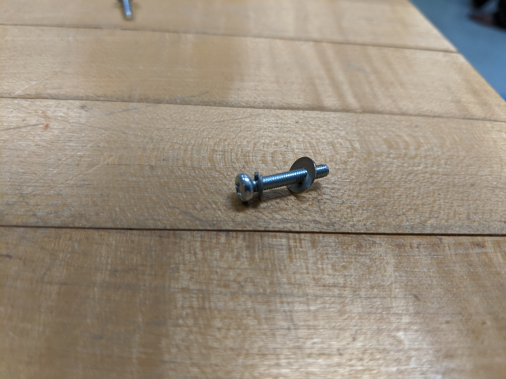
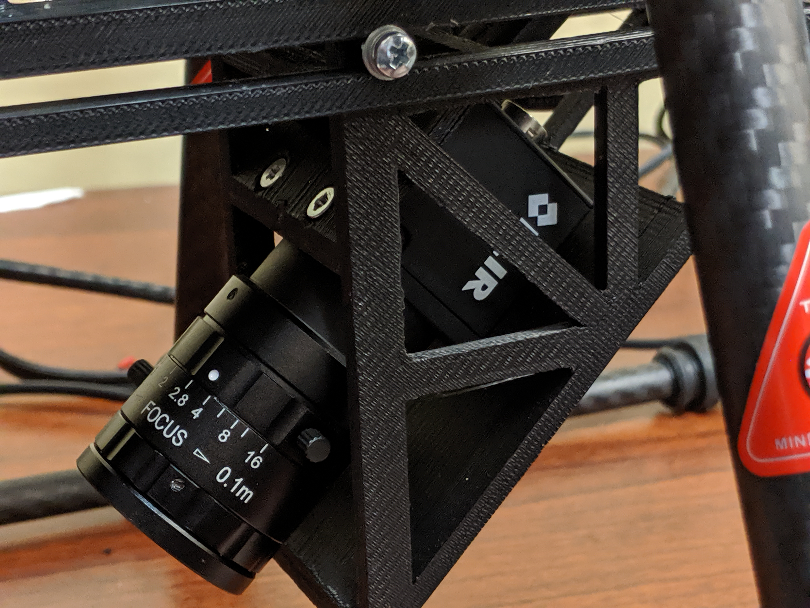
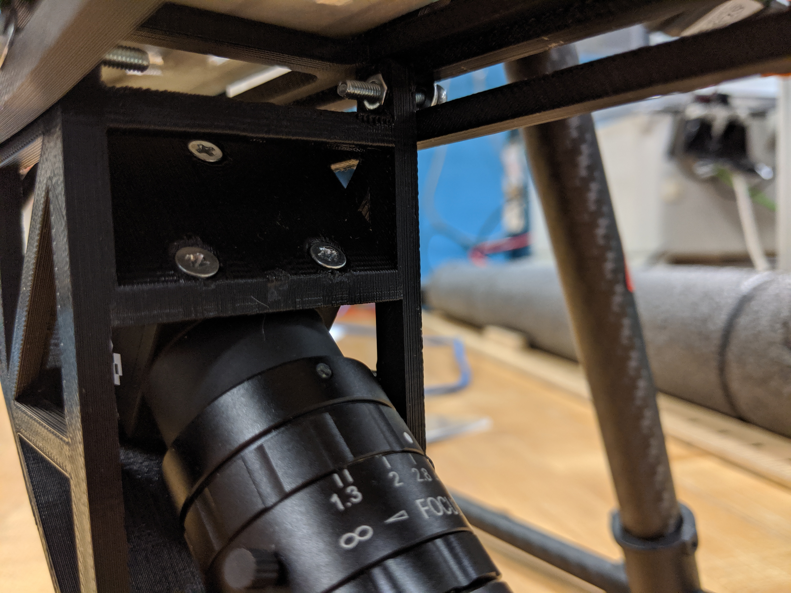
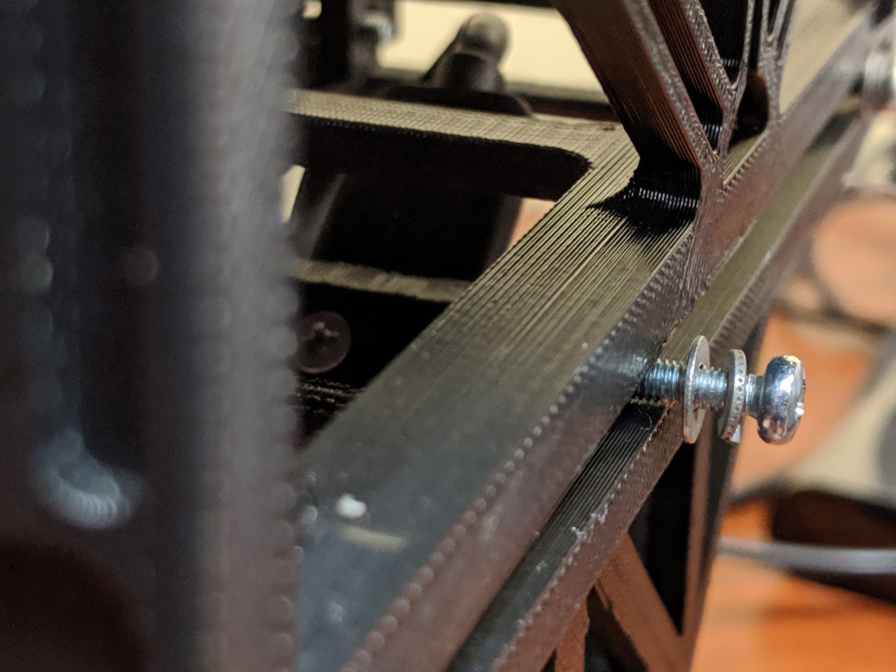
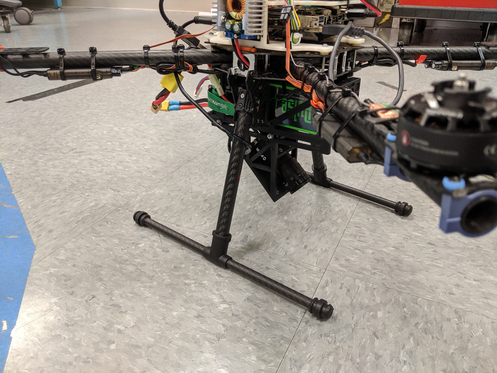

# usma_bhg
### TODOs
- Migrate FLIR img_save to a nodelet
- Develop scripts to inform us if system is running as expected:
1. Did the Flir driver start successfully
2. Is the CSV being filled out properly
3. Did the Gobiu driver start correctly
4. Are pictures being saved to the correct director
5. Did we leave a lense cap on
6. Warn if disk drive is filling up
7. Develop a script that makes a symlink from the newest data folder to a folder called latest, much like ros logs. Done 17FEB
8. Develop CSV building capability for Gobi

### ROS nodes, launch files, etc. for Bloodhound Gang project (USMA)
This document will show you how to:  
1. Set up a companion computer (NUC, Brix, or similar).
2. Access the companion computer, (e.g. "brix012", "nuc002", etc.) on the USMA BHG T650 platform from a groundstation computer running Ubuntu 16.04 or 18.04.
3. Launch ROS nodes, "bool_pub" and "camera_subscriber", which will allow
4. The toggling of the ROS topic, "record" which indicates whether to start recording images from a FLIR Blackfly camera, which can be mounted to the UAV.
5. Mount the FLIR camera and connect it to the Brix.
------------------------------------------------------
# 1. COMPANION COMPUTER INSTALL INSTRUCTIONS
### a. Option 1: Full Sysem Image
1. Use Clonezilla to image the development Companion Computer.  You will be taking the steps to [Restore](https://clonezilla.org/clonezilla-live-doc.php) an image, but it will be device-device, rather than device-image. 
   
### b. Option 2: From a clean install of Ubuntu
1. Follow the instructions at: https://github.com/westpoint-robotics/os-setup/blob/master/ubuntu18_bhg.md
2. Follow the instructions in part "c. Option3" below, starting with step 2. 

### c. Option 3: From a computer with ROS already installed
1. Use Clonezilla to burn an image with Ubuntu 18.04.  You will be taking the steps to [Restore](https://clonezilla.org/clonezilla-live-doc.php) an image, but it will be device-device, rather than device-image.  

2. Install [Xenics SDK](http://support.xenics.com/Support/Linux_SDK_27.zip) and dependencies.  Follow directions for Ubuntu 18.04 for AMD 64 architecture.  
- Extract the files and cd into the created directory and run the below commands.  
- `sudo apt-get install libusb-0.1-4`  
- `sudo dpkg -i xeneth_2.7.0-181_amd64.deb`  
- Add ip address into your local network  
	- Go to Settings > Network > Wired, and click (+) button to add Gobi camera  
	- In `Identity` tab, put the camera name (ex. `gobi`)  
	- In `IPv4` tab, select `Manual` and enter the following information  
	- Address: `169.254.107.22`  
	- Netmask: `255.255.0.0`  

3. Install Spinnaker SDK and dependancies:  
- Download the SDK from https://flir.app.boxcn.net/v/SpinnakerSDK/folder/69083919457  
- Uncompress the folders to get the folder spinnaker-2.0.0.109-Ubuntu18.04-amd64-pkg/spinnaker-2.0.0.109-amd64  
`sudo apt-get install libavcodec57 libavformat57 libswscale4 libswresample2 libavutil55 libusb-1.0-0 libgtkmm-2.4-dev`  
`sudo sh install_spinnaker.sh`  
- During install process, add a new member to `flirimaging`
<pre>
Would you like to add a udev entry to allow access to USB hardware? If a udev entry is not added, your cameras may only be accessible by running Spinnaker as sudo.  
[Y/n] $ <b>y</b>  
Adding new members to usergroup flirimaging… To add a new member please enter username (or hit Enter to continue):  
<b>Type your computer name (ex. $ user1)</b>  
Writing the udev rules file… Do you want to restart the udev daemon?  
[Y/n] $ <b>y</b>  
Would you like to set USB-FS memory size to 1000 MB at startup (via /etc/rc.local)?  
[Y/n] $ <b>y</b>  
Would you like to make a difference by participating in the Spinnaker feedback program?  
[Y/n] $ <b>n</b>  
</pre>

4. If you do not already have a catkin_ws then create one  
`mkdir -p ~/catkin_ws/src`  
`cd ~/catkin_ws/`  
`catkin_make`  
`echo "source ~/catkin_ws/devel/setup.bash" >> ~/.bashrc`  
`source ~/.bashrc`  

5. Clone dependencies and ROS flir camera drivers into catkin_ws:  
`sudo apt-get install ros-melodic-camera-info-manager ros-melodic-dynamic-reconfigure`  
`cd ~/catkin_ws/src/`  
`git clone https://github.com/westpoint-robotics/flir_camera_driver.git`  
`cd ..`  
`catkin_make`  

6. Install MavROS:  
`sudo apt-get install ros-melodic-mavros`  

7. Install usma_bhg.  
`cd ~/catkin_ws/src/`  
`git clone https://github.com/westpoint-robotics/usma_bhg.git`

8. Edit bashrc:
   a. `cd /home/user1/.bashrc`
   b. `gedit .bashrc`
   c. At the bottom of the .bashrc file, insert the lines (if not already added):
      source /opt/ros/melodic/setup.bash
      source /home/user1/catkin_ws/devel/setup.bash
      export ROS_MASTER_URI=http://[NUC_IP]:11311
      export ROS_IP=[NUC_IP]
   d. Save these changes.
------------------------------------------------------
# 2. Ground Station to Companion Computer Connection
   
a. Ascertaining the Brix IP Address
   
   If you will be operating with access to a WREN connection on post at West Point, the Brix IP Address will be
   10.212.149.243. 
   Otherwise, if you are operating out of the Robotics Trailer for the first time at a new location do the following.
   - Connect a USB hub to a free USB port on the Brix.
   - Connect a USB keyboard and mouse to this hub.
   - Connect one of the trailer monitors with an HDMI cable.
   - Unplug the power cable running from the Brix to the power distribution board on the UAV, and plug in the Brix adapter
     instead (plug the other end into a wall outlet).
   - Turn on the Brix using the power button on the underside of the computer at the aft, port corner with respect to the
     front of the UAV (blue motors).  Log in using standard RRC credentials.
   - Open a terminal and use the command:  
   
      `ip a`  
   
     You should see a line similar to, "link/ether 00:c0:ca:97:df:c1 brd
     ff:ff:ff:ff:ff:ff".  Below that, should read "inet" and then a number, for example starting with 10, or 198, or 
     similar.  This is the start of the IP address you want.  Record this in a project/mission notebook.
   
b. Connecting from the Ground Station
   
   - Your ground station computer should be a laptop or desktop running Ubuntu 16.04, or 18.04.  Turn on and log into this machine, and open a terminal.  Enter:  
   
     `ssh [UAV IP]`  
   
     where [UAV IP] will be the address from 1a.  You will be prompted for a password, which will be the RRC standard.  Once 
    logged in, your terminal prompt should read, "user1@brix012", or similar (whatever the name of your companion computer is 
    to the right of the "@".
------------------------------------------------------   
# 3. Launching image capture nodes
   - On your ground station computer, in the terminal from 1b., run the command:  
                            
     `roslaunch usma_bhg master.launch`   
     
     you should be able to tab complete the package and launch file.  If successful, you should see output about the names of 
     the nodes you lauched, and ROS_INFO messages about "Starting Publisher", and then "Number of cameras detected: 1" (if 
     you see 0 instead of 1 here, you may have to restart the launch).  You will then see streaming by, "recordData: 0", 
     which is a message from the subscriber indicating that the topic, "record" has the value "0" right now.  This means no 
     images are being recorded.
  
## NOTE: before recording images, or flying, you will want to ensure removal of the FLIR lens cap!
------------------------------------------------------
# 4. Starting and Stopping Image Recording
   - To start recording images, bring up a new terminal.  Here you will use ROS to publish a message, which will tell any subscribing camera scripts to start acquiring and saving images.  Enter: `rostopic pub /record /std_msgs/Bool True`  Use Ctrl-C to get a new prompt; this will not stop the publishing of the "record" topic.
   - To stop recording, Enter: `rostopic pub /record /std_msgs/Bool False`.  You can toggle back and 
     forth using these two buttons as much as you want.
------------------------------------------------------   
# 5. Mounting the FLIR
   - Locate the mounting bracket, screws, and washers for mounting.
     
     
     
     
   - Insert the camera into the bracket with the "FLIR" logo on the side upsidedown, and screw into place as shown.
     
     
     
   - Plug in USB3 cable into the back of the FLIR, and plug the other end into a spare port (not a hub!) on the companion 
   computer. 
   - Place the bracket between the rails on the battery cage at the bottom of the UAV.  Position the bracket such that the 
     center of the FLIR's lens is as close to centered as possible.  The camera should point 45 degrees downward and toward 
     the front of the craft (blue motors).
   - Screw the bracket into place on the rails.  Beware that the nuts in the top of the bracket may fall out if too much 
   force is applied during installation.
     
     
     
